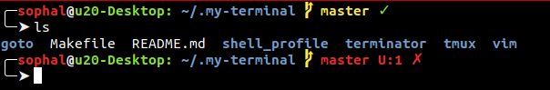
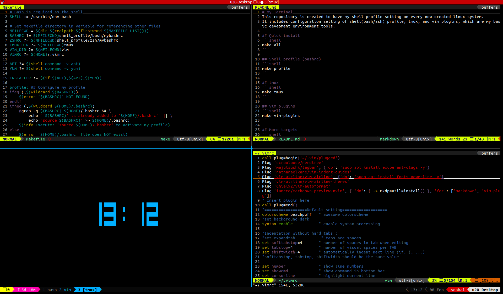
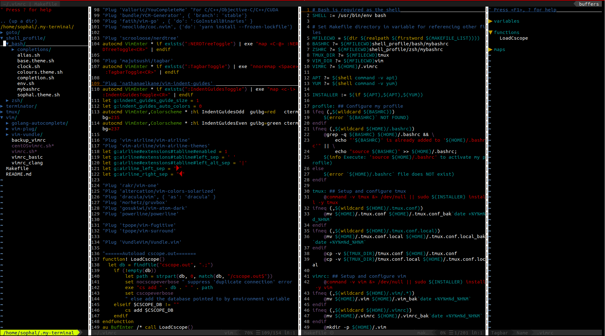

# My Terminal
This repository is created to have my terminal setting on every new created linux system.
It includes configuration setting of **shell(bash/zsh) profile**, **tmux**, and **vim plugins**, which are my basic development environment tools.

## Quick install (copy-paste)
```shell
bash <(curl -s https://raw.githubusercontent.com/sophalHong/.my-terminal/master/.one-click)
```

### Install all (profile, tmux, vim-plugins)
```shell
make all
```

### Shell profile (bashrc)
```shell
make profile
```


### Tmux ([gpakoz/.tmux](https://github.com/gpakosz/.tmux))
```shell
make tmux
```


### vim plugins
```shell
make vim-plugins
```


### clean
```shell
make clean
```

### More targets
```shell
Usage: make [TARGET ...]

help                           Show this help menu.
all                            Install all default basic setting (bashrc,tmux,vim-plugins)
profile                        Configure my profile
tmux                           Setup and configure tmux
vimrc                          Setup and configure vim
vim-plugins                    Install default basic vim plugins
vim-airline                    Install 'Airline' and 'Airline-themes' vim-plug
vim-editorconfig               Install 'editorconfig' vim-plug
vim-fugitive                   Install 'vim-fugitive' vim-plug (Git plugin for Vim)
vim-indent                     Install 'Indent' vim-plug
vim-install-plugin             Install specific Vim plugin (PLUGIN=<username>/<plugin> required)
vim-markdown                   Install 'markdown-preview.nvim' vim-plug
vim-nerdtree                   Install 'nerdtree' vim-plug
vim-plug                       Install vim-plug
vim-surround                   Install 'surround' vim-plug
vim-tagbar                     Install 'tagbar' vim-plug
clean                          Clean up all my settings (profile, tmux, vim-plugins)
clean-profile                  Clean up my profile setting
clean-tmux                     Clean up my tmux setting
clean-vim                      Clean up my vim setting
```
